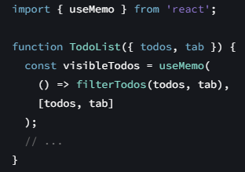

# `useMemo`와 `useContext`에 대한 고찰

## 1. `useMemo`

**정의**: `useMemo`는 리랜더링 간의 계산 결과를 저장(캐싱)할 수 있는 React 훅입니다.

**선언 방법**:

```jsx
const cachedValue = useMemo(calculateValue, dependencies);
```

calculateValue : 캐시하려는 값을 계산하는 함수
dependencies : 의존성 배열

**왜 쓰나요** :

1. 계산이 오래 걸리는 과정을 저장 가능
2. 상태값 변화가 없으면 스킵 가능



1. filterTodos라는 함수의 초기 세팅을 useMemo로 캐싱한다.
2. 의존성 배열의 todos나 tab 중 하나의 상태가 바뀌었을 경우 filterTodos를 재 실행한다.
3. 바뀌지 않았을 경우 초기 세팅 값을 반환한다.

**주의 사항**:

1.  useMemo는 hook이므로 구성요소 또는 자체 Hooks의 최상의 수준에서만 호출 가능
2.  Strict 모드에서 React는 우연한 불순물을 찾는 데 도움을 주기 위해 계산 함수를 두 번 호출을 해서 예기치 못한 영향을 미칠 수 있다. 이 문제는 순수 함수를 사용해서 논리에 영향을 주지 않으면 하나의 결과가 무시되어 안정적으로 사용이 가능하다.

3.  react는 특별한 이유가 없는 한 캐시된 값을 버리지 않지만, 캐시를 버리며 더 많은 기능을 추가할 수 있기에 되도록 성능 최적화에만 useMemo사용을 권장함.

**순수함수가 아닌 함수들 ( 부작용이 있는 함수 )**:

_let total = 0;_

_function addNumberToTotal(number) {
total += number; // 외부 변수인 total을 변경하고 있으므로 부작용이 있음
return total;
}_

_function getCurrentTime() {
return new Date(); // 현재 시간을 반환하므로, 다른 시간에는 항상 다른 결과를 반환함
}_

## 2. `useContext`

**정의**: `useContext`는 React 컴포넌트에서 context를 읽고 사용할 수 있는 Hook입니다.

**선언 방법**:

```jsx
const ThemeContext = createContext(null); // 선언
const value = useContext(SomeContext); // 참조
```

SomeContext : 이전에 만든 context로 정보 자체를 가진게 아니라 읽을 수 있는 포인터? 만 나타낸다.

**왜 쓰나요** :

1. 리액트는 컴포넌트끼리 props를 주고 받는데, 규모가 커질수록 컴포넌트의 개수가 늘어나고, 사용하지 않는 props도 그 이후의 컴포넌트를 위해 받아야 하므로 가독성과 유지보수 측면에서의 단점을 보완하기 위해 사용된다.

**구동 과정**:

1. const themeContext = createContext(null)로 context를 생성한다.
2. 함수형 컴포넌트에서 props를 물려줄 컴포넌트를
   <themeContext.Provider value={props}>
   <Page />
   </themeContext.Provider>
   이렇게 감싸준다.
3. Page 컴포넌트에서 const props = useContext(themeContext)로 context를 불러온다
4. Page 컴포넌트에서 props를 사용할 수 있게 된다!

**주의 사항**:

1. useContext의 호출을 수행하는 <context.Provider>은 항상 props를 전해줄 컴포넌트의 상위 구성요소에 존재해야 한다.
2. Conest의 값이 변경되면 해당 값을 사용하는 모든 자식 컴포넌트들이 리랜더링된다. memo 또한 해당 값을 사용하는 자식 컴포넌트들이 리랜더링 된다.
3. 모듈이 중복으로 생성되면 context가 올바르게 동작하지 않을 수 있다.
   예)
   최상위 컴포넌트에서 props를 a로 줌
   상위 컴포넌트에서 useContext로 props를 불러오고 그 값을 바꿈
   그 아래의 컴포넌트는 값이 바뀐 props를 갖게 됨
